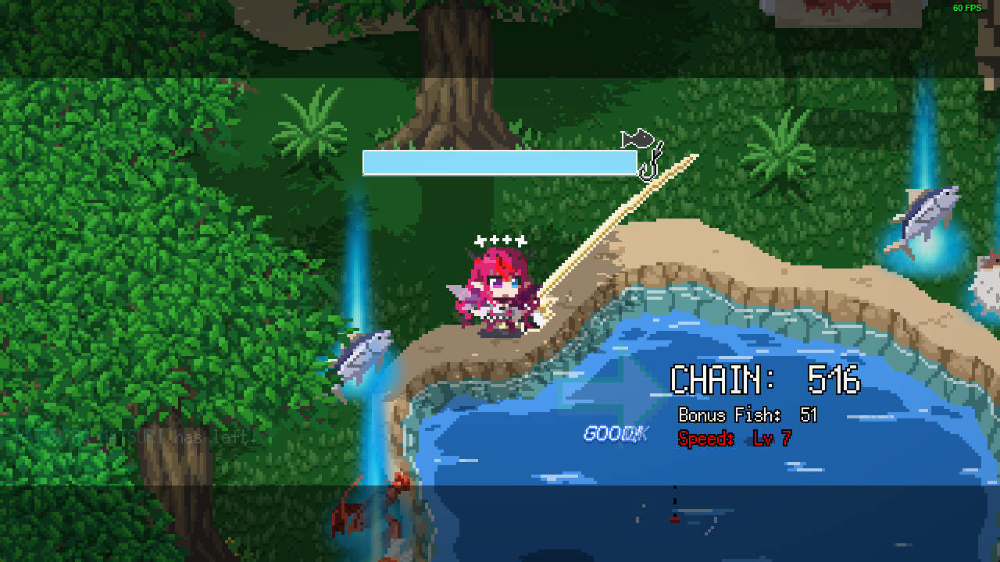
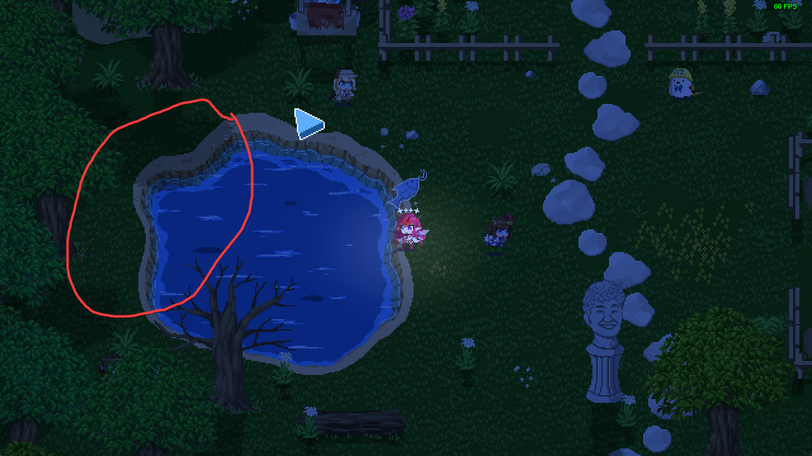

# Automated HoloCure fishing

This project aims to automate the fishing in HoloCure

To make this work, play HoloCure in **windowed mode at 1280x720** and **don't move/minimize** the window once you have started fishing

# To use the program, 
[Video Tutorial](https://drive.google.com/file/d/14Xha8OWFiv26zBD4cYjMsHLD896q8RH4/view?usp=sharing) for absolute beginners.

1. Clone this project
1. Open holocure_fishing.py
1. Open HoloCure and go to Holo House
1. Start fishing
1. Enjoy

# Requirements
If you have python installed, run:
`pip install -r requirements.txt`

Or

* python 3.11 or later
* pyautogui (`pip install pyautogui`)
* pywin32 (`pip install pypiwin32`)
* opencv-python (`pip install opencv-python`)

# Tip
The best area to fish is on the upper left side of the pond.
This will eliminate possible disturbances to the hit area.

